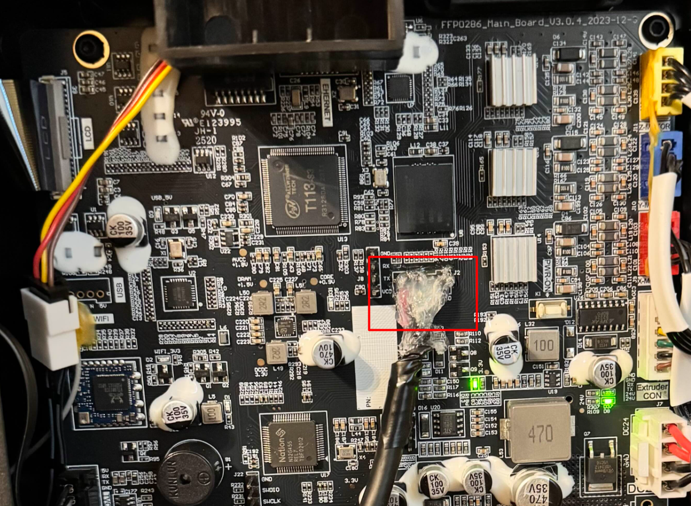

# AD5M Pro Nozzle Servo-Based Nozzle Wiper Mod

This is a servo-based nozzle wiper for the AD5M Pro. Looking at the non-Pro version of the printer, it looks like it should also fit, but I do not have one to test on.

The AD5M and AD5M Pro printers do not provide ample overtravel or an area to place a nozzle wiper that does not obstruct the print space.

Some people compromise and just stick a nozzle wiper pad right on the bed, or print an adapter that allows them to snap it to the bed. While we should not have to compromise on build-plate space, there is another issue with this- this is only sufficient for prints where the nozzle is only automatically wiped at the beginning, or for short prints. Where the bed rises, this becomes an issue for tall prints where we need to periodically wipe the nozzle mid print, such as when using PETG.

This solution addresses this by placing the servo and wiper in a top corner, minimizing the chance of useful build space being obstructed. Since it is positionally locked on the Z-axis, minimal bed movement is required to wipe the nozzle (only the amount necessary for head travel, or enough the clear the servo horn if printing in that corner.)

This could also likely be done with some of the specialized Klipper extension boards already on the market- however, those are significantly more expensive, seem to require similar technical barriers, and I had several cheap STM32 dev boards on hand already. After all, a Klipper extension board is just an MCU with Klipper firmware.

## Credits

[프린트 오버](https://www.printables.com/model/1528725-ad5m-pro-nozzle-wiper) on Printables for the concept and models. When seeking a servo-based solution, I came across this but there were no technical implementation details.

[bogdankecman](https://www.printables.com/model/679341-bluepill-case) on Printables for the STM32F103 Bluepill case. I removed the text from the back and added a lip on one end to make the case more suitable for permanent mounting inside the printer [The modified model can be found here.](https://cad.onshape.com/documents/ffa9c96876a44d3f7edf97fa/w/93b1f104ec1936c0e7b322d2/e/cb52f14f3b8acd4b6f47c6f2)

[DrA1ex](https://github.com/DrA1ex/ff5m) for the Forge-X Klipper mod. Any Klipper mod should be sufficient for this project as long as you can configure it, although if not using Forge-X, the klipper version and configuration steps may be different for you.

## TODO

- [ ] Make `/dev/ttyACM0` more specific
- [ ] Get proper silicone nozzle brush
- [ ] Identify and document proper mounting hardware (bolt sizes)
- [ ] Write nozzle printing macro
- [ ] Write macro to perform nozzle wipe every *n* layers

## Prerequisites

- AD5M with Klipper mod- I used Forge-X, so if you use something different the build and configuration steps may be different
- If you plan to use a USB header on the mainboard or use an MCU without pre-soldered headers, you should be comfortable soldering and have an appropriate iron/supplies.

## Materials List

- Filament for servo mount and horn, and the MCU case for mounting, preferably something that can handle some heat. I used [Overture ASA](https://www.amazon.com/OVERTURE-Printer-Filament-Black-1-75/dp/B09DCQ972K). If your printer isn't enclosed, ASA is probably not ideal or necessary.
- [SG90 Servo](https://www.amazon.com/Micro-Servos-Helicopter-Airplane-Controls/dp/B07MLR1498)
- MCU board with a chip supported by Klipper v0.11.0 (Klipper version may vary, Forge-X uses v0.11.0 as of writing). 
  - I used an [STM32F103C8T6 Bluepill](https://www.amazon.com/WWZMDiB-STM32F103C8T6-Minimum-Development-Learning/dp/B0BVFKRKHS), which requires an [st-link](https://www.amazon.com/ST-LINK-V2-circuit-debugger-programmer/dp/B00SDTEM1I) or other compatible external programmer. If you don't have one, you could opt for an [STM32F401 blackpill](https://www.amazon.com/EC-Buying-STM32F401CCU6-Development-STM32F401/dp/B0CPJGHMPR), which is also supported by Klipper and has a DFU mode (Klipper does *not* support the STM32F*411*. Be careful, as not all blackpills are the same). Note however, that these typically ship with USB-C, which may have additional considerations if you are soldering to the mainboard. It also may not fit in the linked bluepill holder. I chose the Bluepill because it was convenient for me at the time.
  - On another sidenote, the STM32 bluepill and blackpill have a pinout in one corner that conveniently matches the cable header on most SG90 servos. Other boards may require additional wires or soldering to connect the servo.
- Silicone Nozzle Brush
- Shielded micro-usb cable. 
  - The shielding is extremely important- don't skimp on this- many wires on the printer run on PWM, which USB is sensitive to.
  - I ran a USB 3.0 extension cable from the mainboard into the chamber, and then a shorter shielded microUSB cable from it to the MCU. A single microUSB cable would have sufficed, but this is what I had on hand. 
- Something to secure MCU and cables. I used Scotch Extreme mounting tape and gorillla tape.

## Setup / Details

### Building Klipper for the STM32

These are steps to build and flash Klipper to an STM32 on Ubuntu 24.04. To start, we'll install the build dependencies besides GCC:

```bash
sudo apt install -y git wget make build-essential dfu-util stlink-tools python3 python3-venv
```

Since I am using the Forge-X mod on top of stock firmware, I used an old version of Klipper (v0.11.0). The modern ARM toolchain that ships with Ubuntu as of the time of writing (14) will not build this version of Klipper out of the box, so we'll be manually installing an older version (11.3). If you are using a different Klipper mod that doesn't use v0.11.0, you are on your own for this step.

Make and enter a toolchains folder:
```bash
mkdir -p ~/toolchains
cd ~/toolchains
```

Download ARM Toolchain:
```bash
wget https://developer.arm.com/-/media/Files/downloads/gnu/11.3.rel1/binrel/arm-gnu-toolchain-11.3.rel1-x86_64-arm-none-eabi.tar.xz
```

Extract toolchain (this takes a minute with no output- be patient):
```bash
tar -xJf arm-gnu-toolchain-11.3.rel1-x86_64-arm-none-eabi.tar.xz
```

Place toolchain in your PATH- add this to .bashrc (or appropriate file), or make sure to run this in any new shell sessions before building Klipper:
```bash
export PATH="$HOME/toolchains/arm-gnu-toolchain-11.3.rel1-x86_64-arm-none-eabi/bin:$PATH"
```

Move back to home directory, clone Klipper, and enter the directory:
```bash
cd ~
```
```bash
git clone https://github.com/Klipper3d/klipper
```
```
cd klipper
```

Checkout the `v0.11.0` tag:
```bash
git checkout v0.11.0
```

Now it is time to configure the build:
```bash
make menuconfig
```

STM32F103C8T6 Bluepill Settings (Make sure set to `No bootloader`, unless ):
```
[ ] Enable extra low-level configuration options
    Micro-controller Architecture (STMicroelectronics STM32)  --->
    Processor model (STM32F103)  --->
    Bootloader offset (No bootloader)  --->
    Communication interface (USB (on PA11/PA12))  --->
```

STM32F401CCU6 Blackpill Settings (Make sure to set `No bootloader` and set the clock to `25 MHz Crystal`):
```
[*] Enable extra low-level configuration options
    Micro-controller Architecture (STMicroelectronics STM32)  --->
    Processor model (STM32F401)  --->
    Bootloader offset (No bootloader)  --->
    Clock Reference (25 MHz crystal)  --->
    Communication interface (USB (on PA11/PA12))  --->
    USB ids  --->
()  GPIO pins to set at micro-controller startup (NEW)
```

After configuring, type `Q` and `Y` to save the config and exit. Then, go ahead and build Klipper. There will be some scary looking warnings. As long as it ends with `Creating hex file out/klipper.bin`, this is fine:
```bash
make
```

### Flashing Klipper to the STM32

#### Flashing the STM32F103C8T6 Bluepill (or the blackpill) with an ST-Link

Connect the SWDIO, SWCLK, GND, and RESET pins between the ST-Link and the Bluepill. Also connect power to the Bluepill. This can be via a separate microUSB cable or using a 3v3 or 5v pin on the ST-Link if it provides an output for it. Plug the ST-Link into the Ubuntu machine via USB.

(In this setup, with the stlink-v3, separate USB power to the bluepill is recommended, which is why the brown wire is not connected)


Run the following command from the klipper directory to flash it:
```bash
sudo st-flash --reset write out/klipper.bin 0x08000000
```

#### Flashing the STM32F401CCU6 Blackpill via DFU Mode

Press and hold the BOOT0 button on the blackpill. While holding the button, connect the blackpill via USB. After a second or so, release the BOOT0 button. Run the following command from the klipper directory to flash it:

```bash
sudo dfu-util -a 0 -D out/klipper.bin --dfuse-address 0x08000000:leave
```

#### The STM32 should now be ready to use with Klipper

### Run USB and mount MCU as desired

It is important to use a shielded cable, especially if connecting to the mainboard, because there are a lot of high-interference PWM wires going to the motors you'll likely need to route near. You could also chose the front USB port, but it will be unusable for anything else if you do.

In my case, I ran a shielded USB 3.0 extension cable from the mainboard into the print chamber, taping it to the side wall of the enclosure. The main reason I chose to do it this was is that I did not want to be limited to either microUSB or USB-C. Also, my extension cable has an exposed shield on the female end, and I didn't exactly want a loose ground floating around near the mainboard. You could setup a specialized connector on the USB header, but I opted to cut the male end of the cable and solder it directly to the board. I then covered it up with hot glue to insulate and prevent the weight of the cable from stressing the thin USB wires.



Unfortunately, I neglected to take a photo before applying the hot glue, but the wires are soldered in the following order:

```
5V      -> RED
N       -> WHITE
P       -> GREEN
GND x2  -> BLACK/SHIELD
```

From there, I ran a shorter, shielded microUSB cable to the MCU that I mounted to the side wall of the enclosure:


### Configure Klippy to use the MCU

Connect to a shell on the printer. On Forge-X, this can be via SSH or via the UART header on the mainboard.

Next, create a file with the configuration for the MCU. I'm using the bluepill, so I've named my mcu and pins accordingly, but this doesn't have any technical significance. On Forge-X (This may be different for you if using a different Klipper mod), after SSHing in, you can find the `printer.cfg` file at `printer_data/config/printer.cfg`, so we'll create `bluepill.cfg` next to it:

```bash
nano printer_data/config/bluepill.cfg
```
(Apologies for not being l33t enough to use vim)

Add the following contents:
```
[mcu bluepill]
serial: /dev/ttyACM0

[output_pin bluepill_led]
pin: bluepill:PC13
value: 1
shutdown_value: 1

[servo nozzle_wiper]
pin: bluepill:PB9
minimum_pulse_width: 0.0005
maximum_pulse_width: 0.0025
```

If you connect other USB CDC devices to the printer, `/dev/ttyACM0` might not be accurate anymore and cause issues. I haven't figured out a way to make this more specific yet (TODO). Additionally, the minimum and maximum pulse widths may need tuned if you have issues.

After saving this (`Ctrl+O`, `Enter`, and then `Ctrl+X` in nano), go ahead and add the config to `printer.cfg`:

```bash
nano printer_data/config/printer.cfg
```

Add the following line near the top. I chose after the other includes but before the first block (`[extruder]` on my machine):
```
[include ./bluepill.cfg]
```

Like before, go ahead and save and exit this file, and then reboot the printer:
```
reboot
```

If the printer fails to boot, the most likely causes are a mistake in the Klipper configuration, or that the USB connection is not stable enough (This is when I learned from the mistake of not using a shielded cable).

### Test the MCU

After the printer has booted back up, we can test the MCU with Klipper commands. On Forge-X, we can do this from fluidd.

To turn the dev board's LED on (I know zero is weird, but the bluepill LED is active low):
```
set_pin pin=bluepill_led value=0
```

And off:
```
set_pin pin=bluepill_led value=1
```

### Orient the servo

Before attaching the horn to the servo, it's important to orient/calibrate it. Attach the servo cable to the MCU (brown to GND, red to 5V, yellow/orange to PB9 - do this while the printer is off or be very careful not to plug it into the wrong pins while on), and set the angle to zero degrees via klipper:

```
set_servo servo=nozzle_wiper angle=0
```

Go ahead and remove the servo and fasten the horn to it so that it is aligned with the side opposite the wires, being careful not to turn the gears. This way, 0 degrees can be the wiper retracted, and 90 degrees can be the wiper extended.

### Install the wiper

You can now mount the servo and it's holder to the side of the printer:


To extend the wiper:
```
set_servo servo=nozzle_wiper angle=90
```

And to retract the wiper:
```
set_servo serv0=nozzle_wiper angle=0
```

The original concept I came across on Printables shows the wiper going back and forth in small motions under the nozzle. I would recommend against this, as we should avoid overdrawing from the servo- it runs on the 5V regulator on the mainboard, and this does not have a particularly high current rating, as it's intended for USB VBUS, not general power. It's doubtful that permanent damage will occur, but you may experience brownouts if you overuse it. Instead, consider moving the nozzle in small movements over the wiper, as the hardware is more suited to this. This section, as well as a few more will be extended as I acquire/identify better mounting hardware and write macros.